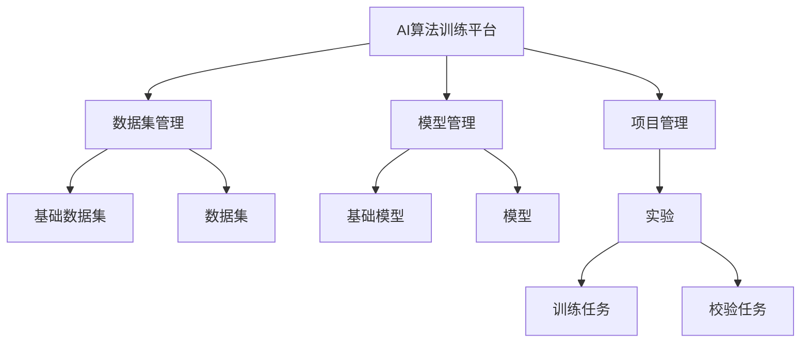
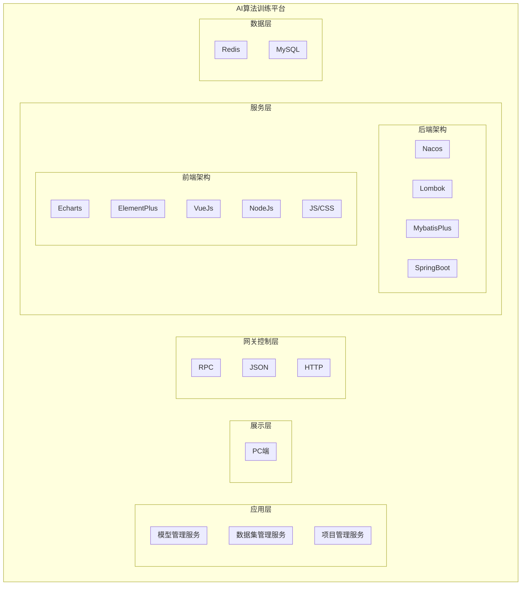
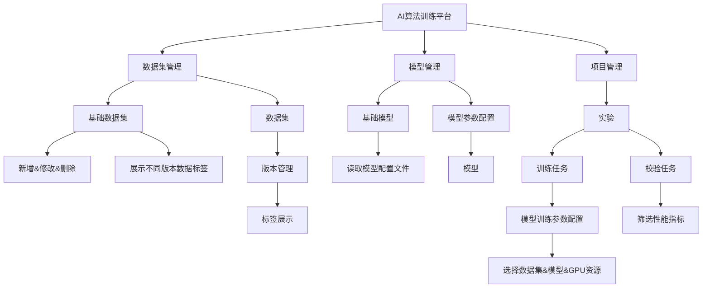
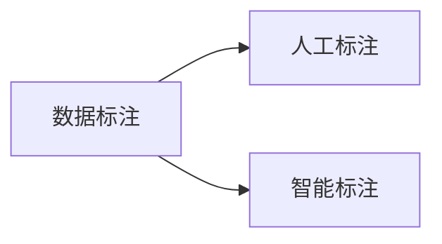
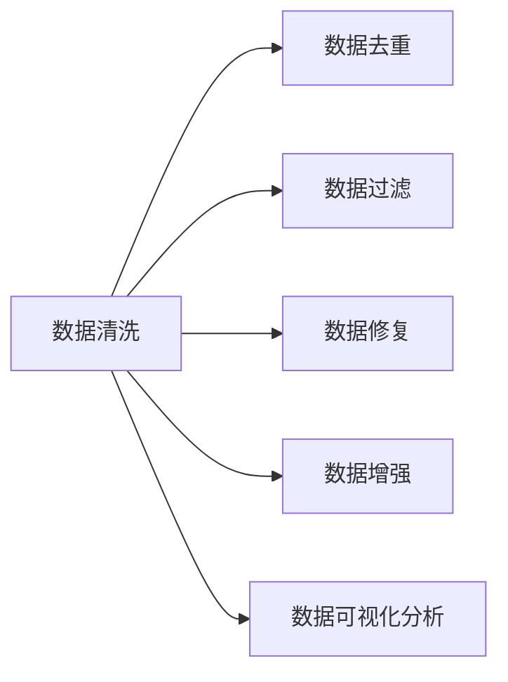
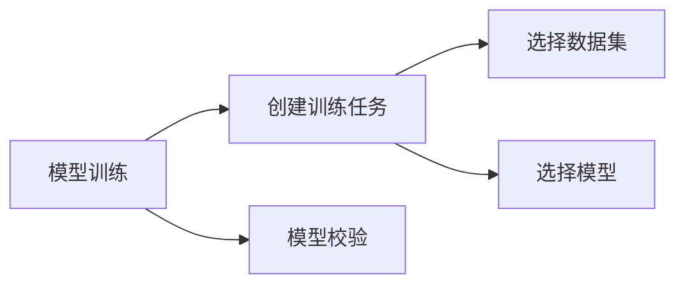
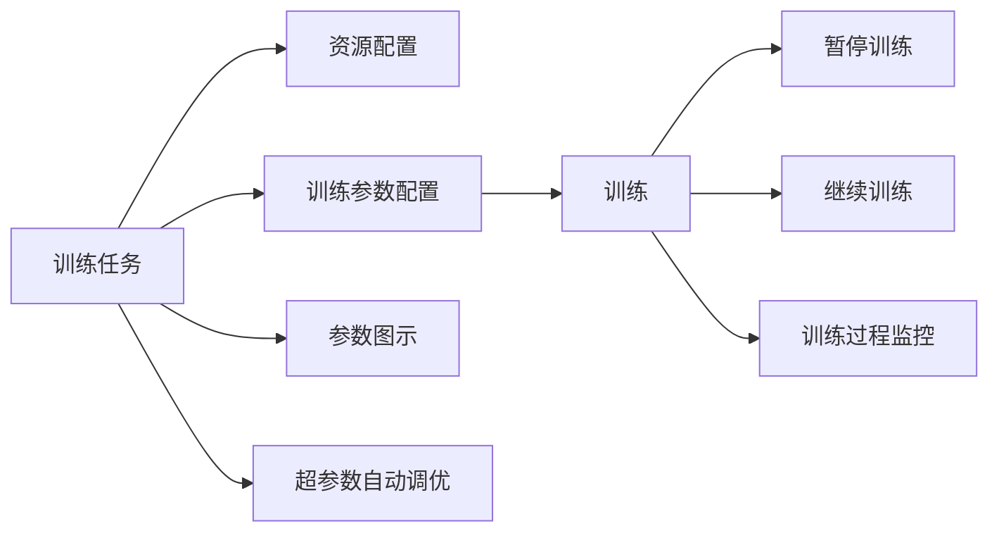
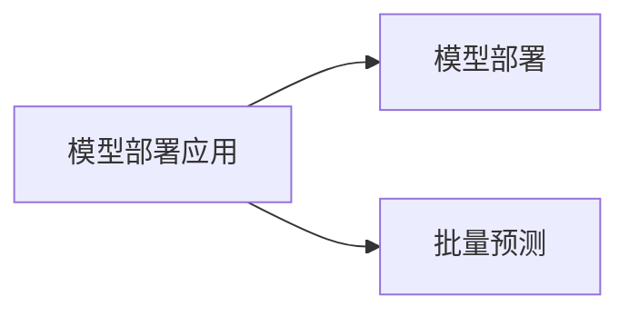

### 1、前言

#### 1.1、文档目的

文档编写目的是为了阐述AI算法训练平台系统的概要设计。概要设计说明书是为了说明系统的体系架构，以及需求用例的各个功能点在架构中的体现，为系统的详细设计人员进行详细设计时的输入参考文档。本说明书的预期读者为项目管理人员系统设计人员、系统开发人员和项目评审人员。

#### 1.2、文档范围

本文档作为产品概要设计说明书，编写的目的是为了定义所要开发的目标，主要描述系统的总体设计、数据库设计、系统高可用设计、系统对接设计。阐述一个软件系统必须提供的功能和性能以及它所要考虑的限制条件，尽可能完整地描述系统预期的外部行为和用户可视化行为，为软件设计和开发提供依据，作为软件功能追溯的基础和软件开发工作量确定的蓝本。

#### 1.3 读者对象

本说明书的面向：项目管理人员、设计人员、开发人员、测试人员等。

### 2、总体设计

#### 2.1 基本设计思想

项目具体设计思路如下：

1. **充分利用现有资源的原则**：本项目的建设是在充分整合现有系统的基础上进行的，因此，本项目要充分继承当前系统的信息数据、业务流程和人员操作习惯等，充分利用已有的网络、硬件环境，在现有系统的基础上，采用新建与整合并进的方式进行实施。
2. **先进性和适用性相结合**：在系统设计上，首先应当具有前瞻性。在保证系统经济性的前提下整个软、硬件系统的适度超前性，以确保在较长的时间内保持系统的先进性，充分发挥投资效益。与此同时，还应当结合政务服务发展的实际情况，在保证实现系统建设目标的前提下，尽量选择较高性能、高价格比的技术和产品。
3. **易维护性和扩展性原则**：随着业务的发展，系统在设计上考虑到未来功能的开发能够预留一定的应用扩展空间。框架完全自主开发，实现功能模块化、组件化、可继承，数据访问层统一采用MyBatis-Plus代码生成器生成，一定程度上减轻开发人员负担并有效避免低级错误；业务逻辑层常用函数统一使用MyBatis模版生成，自定义函数编写也采用高度集合继承与封装方式，全部或部分使用泛类进行操作。UI层使用Element-Plus及ECharts框架，只需要传入相关的数据库表名和相关参数，可以减轻开发人员对于UI绘制以及分页、排序、新增、编辑与删除等各种常用功能所花费的开发时间。

#### 2.2 系统架构设计

系统整体结构图如下：

本项目建设内容主要为AI算法训练平台。本平台为广东大湾区空天信息研究院算法组使用，为算法组提供可视化开箱即用的机器学习服务；无论是小型实验还是企业级应用均可。

#### 2.3 需求规定

包括对功能、性能、可靠性、安全性、维护性、成本等方面的需求进行规定。以下是一些常见的概要设计需求规定：

1. **功能需求**：描述系统应该具备的功能和性能，包括输入、输出、处理等方面的要求。例如，系统应该能够完成哪些操作、提供哪些报表等。
2. **性能需求**：描述系统应该具备的性能指标，包括响应时间、处理速度、负载能力等方面的要求。例如，系统应该能够在多长时间内完成哪些操作、能够处理哪些数据等。
3. **可靠性需求**：描述系统应该具备的可靠性指标，包括平均无故障时间（MTBF）、平均故障修复时间（MTTR）、故障率等方面的要求。例如，系统应该能够保证多长时间内正常运行、故障修复时间应该控制在多长时间内等。
4. **安全性需求**：描述系统应该具备的安全性指标，包括访问控制、数据保护、防止恶意攻击等方面的要求。例如，系统应该能够对用户的访问权限进行控制、应该能够保护数据的机密性和完整性、应该能够防止SQL注入等攻击。
5. **维护性需求**：描述系统应该具备的维护性指标，包括可维护性、可扩展性、可测试性等方面的要求。例如，系统应该能够方便地进行升级、应该能够方便地进行扩展、应该能够方便地进行测试等。
6. **成本需求**：描述系统应该考虑的成本因素，包括开发成本、运营成本、维护成本等方面的要求。例如，系统应该控制在一定的预算范围内、应该考虑运营和维护的成本等。

#### 2.4 平台技术路线

##### 2.4.1 B/S架构

根据需求，系统架构全部采用B/S架构，降低由于部分系统单独部署安装带来的大量维护工作和维护费用以及时间。B/S（Browser/Server）结构即浏览器和服务器结构。它是随着Internet技术的兴起，对C/S结构的一种变化或者改进的结构。在这种结构下，用户工作界面是通过WWW浏览器来实现，极少部分事务逻辑在前端（Browser）实现，但是主要事务逻辑在服务器端（Server）实现，形成所谓三层3-tier结构。这样就大大简化了客户端电脑载荷，减轻了系统维护与升级的成本和工作量，降低了用户的总体成本（TCO）。

##### 2.4.2 使用HTML5技术，诠释web2.0的技术内涵

Web2.0带来的丰富互联网技术让所有人都享受到了技术发展和体验进步的乐趣。作为下一代互联网标准，HTML5自然也是备受期待和瞩目。HTML5将会取代1999年制定的HTML 4.01、XHTML 1.0标准，以其能在互联网应用迅速发展的时候，使网络标准达到符合当代的网络需求，为桌面和移动平台带来无缝衔接的丰富内容。

##### **2.4.3** Redis技术

1. Redis是一个开源的使用ANSI C语言编写、支持网络、可基于内存亦可持久化的日志型、Key-Value数据库，并提供多种语言的API。redis是一个key-value存储系统。和Memcached类似，它支持存储的value类型相对更多，包括string（字符串）、list（链表）、set（集合）、zset（sorted set --有序集合）和hash（哈希类型）。这些数据类型都支持push/pop、add/remove及取交集并集和差集及更丰富的操作，而且这些操作都是原子性的。在此基础上，redis支持各种不同方式的排序。与memcached一样，为了保证效率，数据都是缓存在内存中。区别的是redis会周期性的把更新的数据写入磁盘或者把修改操作写入追加的记录文件，并且在此基础上实现了master-slave（主从）同步。
2. Redis 是一个高性能的key-value数据库。 redis的出现，很大程度补偿了memcached这类key/value存储的不足，在部 分场合可以对关系数据库起到很好的补充作用。它提供了Java，C/C++，C#，PHP，JavaScript，Perl，Object-C，Python，Ruby，Erlang客户端，使用很方便。
3. Redis支持主从同步。数据可以从主服务器向任意数量的从服务器上同步，从服务器可以是关联其他从服务器的主服务器。这使得Redis可执行单层树复制。存盘可以有意无意的对数据进行写操作。由于完全实现了发布/订阅机制，使得从数据库在任何地方同步树时，可订阅一个频道并接收主服务器完整的消息发布记录。同步对读取操作的可扩展性和数据冗余很有帮助。

##### 2.4.4  Java EE体系架构

Java EE 是在 Java SE 的基础上构建的，它提供Web 服务、组件模型、管理和通信 API，可以用来实现企业级的面向服务体系结构（service-oriented architecture，SOA）和 Web 2.0应用程序。

##### 2.4.5 企业服务总线

企业服务总线（Enterprise Services Bus）和以服务为导向的应用架构体系（SOA）紧密连接在一起， ESB是SOA的核心组成部分，实现各部门、各业务应用系统间信息交互。ESB为SOA提供了连通性基础架构，是SOA架构中应用整合的基础。基于SOA架构的业务系统所开放出来的服务通过ESB进行交互，交互请求以事件的方式进行发布和订阅。

#### 2.5平台技术架构

平台开发采用B/S架构，集成多种异构系统，结合代码协同工具Git，帮助研发人员完成协作开发，使用自动化运维工具，简化部署发布流程；

#### 2.6  运行环境

服务端操作系统：Ubuntu；

服务端运行环境：JDK1.8及以上；

数据库支持：MySQL

协议支持：TCP/IP、HTTP、HTTPS；

硬件支持：服务器CPU 16以上、内存32G以上、需要19T 以上的空闲磁盘空间；

网络环境：有固定公网IP，网络畅通，可以远程访问（远程桌面连接或者借助辅助工具）；

客户端要求：IE6以上。

#### 2.7 开发环境

开发系统：Ubuntu

开发环境：Linux

开发语言：JAVA、html、css、javascript

数据库：Mysql

### 3、功能设计

#### 3.1 需求规定

建设AI算法训练平台，提供开盒即用的深度学习算法服务平台的构建流程。

#### 3.2 平台功能模块图

#### 3.3 功能模块描述

##### 3.3.1 数据集管理

数据集管理提供以下功能：

1. **基础数据集管理**：支持基础数据集的创建、修改、删除、上传、下载等操作，并支持数据集版本管理。
2. **数据集管理**：支持从基础数据集创建不同的数据集，不同版本数据集图像支持不同的标签。
3. **数据标注**：提供数据标注工具，支持多种模态的数据标注功能。
4. **数据增广**：通过数据增强算法提供数据增广功能。
5. **标签展示**：不同数据集版本其标签可能不一致，需要在基础数据集列表展示。

##### 3.3.2 模型管理

模型管理提供以下功能：

1. **基础模型管理**：支持基础模型的查询。其中基础模型为平台共用。
2. **模型管理**：基于基础模型的模型创建、修改等操作。其中模型为平台共用，在模型创建过程中应当使用配置文件对模型进行描述，并约定可变参数与固定参数，可变参数应当允许通过软件UI中相应操作进行更改。
3. **模型参数配置**：支持通过在UI读取基础模型配置文件，动态配置基础模型参数生成模型。

##### 3.3.3 项目管理

项目管理提供以下功能

1. **角色控制项目**：支持同一角色的用户可以操作同一项目；
2. **训练任务**：支持在项目管理中新建训练任务；
3. **校验任务**：支持在项目管理中新建校验任务。

##### 3.3.4 实验

实验提供以下功能：

##### **训练前：**

1. **训练参数配置**：能够在训练任务开始前在UI上设置训练参数，其中包括**优化器**、**学习率**、**批量大小**、**迭代次数**、**数据增强相关参数**、**衰减策略**等。
2. **模型参数配置**：能够在训练任务开始前选择或创建模型，并支持修改模型参数，模型参数相关功能见3.3.2中描述。
3. **模型指标可视化指标**：能够在训练任务开始之前对需要进行可视化的模型指标进行选择。
4. **数据可视化配置**：能够在训练任务开始之前对指定的需要进行可视化的数据类型进行选择。
5. **数据集配置**：能够在训练任务开始之前进行数据集选择，并关联数据集修改功能。

##### **训练中：**

1. **模型指标可视化**：训练过程中应当能够对指定的模型指标使用可交互图表进行可视化。
2. **数据可视化**：训练过程中应当能够对预先设置的其他数据使用可交互图表或图像等形式进行可视化。
3. **训练进度可视化**：训练过程中应当能够通过UI展示训练进度。

##### **训练结束后：**

1. **模型权重检查点管理**：能够在训练结束后对产生的权重检查点进行删除、导出等操作。
2. **模型校验功能**，能够在训练结束后对指定的模型权重进行性能校验，其中包括：

   - **模型校验配置**：提供界面允许用户配置校验过程中的参数，如批量大小、迭代次数等。
   - **性能指标选择**：用户可以选择用于评估模型性能的指标，如准确率、召回率、F1分数、均方误差等。
   - **实时性能反馈**：在模型校验过程中，实时显示性能指标的变化。
   - **校验报告生成**：自动化生成包含性能指标和可视化结果的校验报告。
   - **模型比较**：允许用户比较不同模型或不同版本或不同参数设置下的性能。
   - **模型解释性工具**：提供模型解释性工具，帮助用户理解模型的决策过程。
   - **校验结果导出**：允许用户将校验结果和报告导出为PDF、CSV或JSON格式。

### 4、接口设计

TODO 等数据库设计完毕。

### 5、算法服务器设计

#### 5.1 创建数据集

**功能描述**：

用户可以使用该功能上传数据，并根据需要选择性的进行数据标注，完成数据集的创建。

**操作步骤**：

该系统应当支持相应的算法服务器创建数据集需求。其中操作步骤包括：

**1）数据标注**:

- **人工标注**：

  功能描述：用户可以使用前端提供的交互式界面手动给数据打标签，并生成标注文件。

  - 输入：无
  - 输出：无
  - 调用：无

- **智能标注**：

  功能描述：用户可以调用平台中的算法自动标注数据，并生成标注文件。

  - 输入：已上传的数据集，标签组，算法
  - 输出：标注文件
  - 调用：模型预测

**2）数据清洗**：

- **数据去重**：

  功能描述：用户可以将所选数据集去掉重复的条目，确保数据集的唯一性和准确性。

  - 输入：数据集
  - 输出：数据集
  - 调用：去重算法

- **数据过滤**：

  功能描述：用户可以将所选数据集根据预定义的条件过滤。

  - 输入：数据集，过滤条件
  - 输出：数据集
  - 调用：过滤算法

- **数据修复**：

  功能描述：用户可以将所选数据集进行数据修复，这项功能可以自动识别并修复数据中的缺失值或错误。

  - 输入：数据集
  - 输出：数据集
  - 调用：数据修复算法

- **数据增强**

  功能描述：用户可以通过应用各种图像处理技术来增加训练数据集的多样性，此功能仅适用于训练集。

  - 输入：数据集，选择的算法
  - 输出：数据集
  - 调用：数据增强算法

- **数据可视化分析**

  功能描述：该功能负责分析数据并生成相应的图表，使用户可以直观地理解数据特征。

  - 输入：数据集
  - 输出：数据分析图
  - 调用：数据可视化功能

#### 5.2 创建模型

功能描述：创建模型功能允许用户从算法库中选择模型，并设置模型相关的参数如**优化器**、**学习率**、**损失函数**、等（这个功能需要对用户开放吗？）。

- 输入：用户选择的算法，用户命名的模型名称，模型参数
- 输出：包含用户定义的所有模型参数的文件，用于模型的实例化和训练
- 调用：参数合并功能

#### 5.3 模型训练

该系统应当支持相应的模型训练功能以满足使用需求。其中包括：

**1）创建训练任务**

- **资源配置**

  功能描述：资源配置功能允许用户为模型训练任务选择和指定所需的计算资源。这包括选择使用CPU或GPU、分配内存大小以及配置并行处理选项等。

  - 输入：计算资源（CPU或GPU）及数量
  - 输出：资源占用情况、资源配置
  - 调用：资源管理功能

- **训练参数配置**

  功能描述：此功能允许用户为训练任务选择需要的参数，如**迭代次数**、**批量大小**、**是否加载预训练模型**、**加载的预训练模型**。

  - 输入：训练参数配置、选择的预训练模型
  - 输出：训练参数配置、预训练模型
  - 调用：参数合并功能

- **选择数据集**

  功能描述：此功能允许用户从可用的数据集中选择所需数据集，并根据**训练参数配置**实例化数据集类。这个过程包括数据的加载、预处理和划分，最终形成训练集、验证集和/或测试集。

  - 输入：数据集名称、**训练参数配置**、划分比例等
  - 输出：训练集或验证集或测试集的数据加载器
  - 调用：数据集实例化

- **选择模型**

  功能描述：此功能允许用户从可用的模型中选择所需模型，并根据**模型参数配置**实例化模型。

  - 输入：模型名称、**训练参数配置**
  - 输出：实例化的模型
  - 调用：模型实例化

- **训练**

  功能描述：此功能允许用户选择所需数据集和模型，并根据提供的训练参数进行训练。

  - 输入：实例化的模型、实例化的数据集、资源配置、训练参数配置
  - 输出：模型的评估指标、模型权重，训练进度
  - 调用：模型训练，数据可视化，参数合并功能

- **训练过程监控**

  功能描述：训练过程监控功能允许用户实时跟踪和监控模型训练任务的进度和性能。此功能提供关键的训练指标，如损失率、准确度、以及资源消耗情况（如CPU和GPU使用率）。

  - 输入：训练任务标识，需要观察的评估指标及横坐标度量单位
  - 输出：训练监控报告（实时或者周期性的更新）
  - 调用：资源管理功能，模型训练，数据可视化

- **暂停训练**

  功能描述：此功能允许用户手动暂停训练，并释放占用资源。

  - 输入：训练任务标识
  - 输出：返回训练已暂停的状态，包括暂停的时间点和已保存的模型权重和训练进度等信息
  - 调用：资源管理功能

- **继续训练**

  功能描述：此功能允许用户继续暂停的训练。

  - 输入：训练任务标识，之前保存的训练状态，包括模型权重和迭代进度。
  - 输出：返回训练已继续的状态
  - 调用：资源管理功能，模型训练

- **参数图示**

  功能描述：此功能允许用户查看和分析所选训练任务使用的超参数。通过展示超参数的配置，用户可以更好地理解模型训练的设置和潜在的优化点。该功能提供图形化展示，使超参数的比较和分析更为直观。

  - 输入：训练任务标识。
  - 输出：返回超参数（列表或者图像化展示）
  - 调用：数据可视化

- **超参数自动调优**

  功能描述：超参数自动调优功能通过运行多次训练试验，自动地寻找最优的超参数设置，以最大化模型性能，减少手动调参的需求并提高训练效率。

  - 输入：训练任务标识，选择的超参数优化算法，超参数数值范围，实验次数。
  - 输出：所有超参数组合及对应的评估指标，最优超参数组合产生的模型权重
  - 调用：模型训练功能、数据可视化功能

**2）模型校验**

- **创建校验数据集**

- **模型校验**

  功能描述：模型校验功能允许用户验证已训练模型在新数据集上的性能。此功能目的在于确保模型的有效性和准确性。

  - 输入：模型权重标识、校验数据集
  - 输出：校验数据的预测结果及评估指标，校验进度
  - 调用：模型预测功能、数据可视化

#### 5.4 模型部署及应用

该系统应当支持相应的模型部署及应用功能以满足使用需求。其中包括：

**1）模型部署**

功能描述：模型部署功能允许用户将训练好的模型部署到生产环境中，使其能够接收实时数据并提供预测。

- 输入：模型权重标识
- 输出：部署状态
- 调用：

**2）批量预测**

功能描述：批量预测功能允许用户使用训练好的模型权重得到数据的预测结果。

- 输入：模型权重标识，数据集。
- 输出：预测结果
- 调用：模型预测功能

### 6、系统数据结构

#### 6.1 逻辑结构设计要点

AI算法训练平台采用MYSQL数据库。该数据库基都是关系数据库首先需要将E-R图转换为关系模型，然后根据具体DBMS的特点和限制转换为特定的DBMS支持下的数据模型，最后进行优化。

1. **E-R图向关系模型的转换规则**：一个实体型转换为一个关系模式；一个1:1联系可以转换为一个独立的关系模式，也可以与任意一端对应的关系模式合并；一个1:n联系可以转换为一个独立的关系模式，也可以与n端对应的关系模式合并；一个m:n联系可以转换为一个独立的关系模式；一个多元联系可以转换为一个独立的关系模式；具有相同码的关系模式可以合并；有些1：n的联系，将属性合并到n端后，该属性也作为主码的一部
2. **数据抽象分类**
3. **数据模型优化**：确定数据依赖，对数据依赖进行极小化处理，消除冗余联系。确定范式级别，根据应用环境，对某些模式进行合并或分解。
4. **设计用户子模式**：考虑使用方便性和效率问题，主要借助视图手段实现，包括：建立视图，使用更符合用户习惯的别名；对不同级别的用户定义不同的视图，以保证系统的安全性；对复杂的查询操作，可以定义视图，简化用户对系统的使用。

#### 6.2 数据结构与模块的关系

物理数据结构设计主要是设计数据在模块中的表示形式。数据在模块中都是以结构的方式表示。系统操作对数据库数据结构，也就是数据表进行查询和修改，在操作过程中都需要对数据库中的所有表，进行联合查询、修改。主要用于各模块之间函数的信息传递。接口传递的信息将是以数据结构封装了的数据，以参数传递或返回值的形式在各模块间传输。出错信息将送入显示模块中。

### 7、系统维护设计

#### 7.1 出错情况

系统错误处理机制的出错情况可以包括以下几个方面：

1. **系统异常**：例如系统崩溃、死锁等。
2. **用户输入异常**：例如用户输入的数据不符合要求、用户输入的数据格式不正确等。
3. **网络异常**：例如网络连接中断、网络传输速度过慢等。
4. **硬件异常**：例如硬件故障、硬件损坏等。

#### 7.2 异常处理

系统错误处理机制中的异常处理。异常处理是一种程序控制机制，用于处理运行时发生的特殊情况。这些情况可能会中断正常的程序执行流程，因此需要特别处理。以下是一些在设计异常处理机制时需要考虑的关键元素：

1. **异常类型**：首先，你需要定义可能会在系统中出现的异常类型。这些可能包括输入错误、文件找不到、网络连接失败、数据库错误等。
2. **异常处理程序**：为每种类型的异常设计一个处理程序。这些处理程序应该能够接收异常，并对其进行处理。处理程序可能包括日志记录、错误消息发送、用户反馈等。
3. **异常抛出**：在代码中，当特定错误条件满足时，应该抛出对应的异常。这可以通过使用语言提供的异常抛出语句（如 throw）来实现。
4. **异常捕获**：在代码的适当位置，你需要设置异常捕获块（如 try-catch 语句）。这些块可以捕获并处理异常。你应该在可能抛出异常的代码块周围放置这些捕获块。
5. **错误恢复**：理想情况下，你的系统应该能够从错误中恢复，并继续执行后续的任务。这可能需要设计一种策略，该策略在异常发生后能够重新尝试操作、回滚事务或执行其他适当的恢复步骤。
6. **用户反馈**：当异常发生时，你的系统应该向用户提供反馈。这可能包括错误消息、错误详细信息的展示，以及可能的补救措施或故障排除建议。
7. **日志记录**：系统应该记录所有异常的发生情况，包括发生时间、异常类型、错误详细信息等。这有助于故障排除和性能优化。

#### 7.3 补救措施

补救措施是在异常发生时用于解决问题的方法和步骤。这些措施可以帮助恢复系统的正常运行，并减少错误对系统的影响。以下是一些在设计补救措施时需要考虑的关键元素：

1. **错误识别**：首先，你需要能够识别可能会发生的错误。这可能包括分析错误日志、监控系统运行状态、用户反馈等。
2. **故障恢复策略**：针对不同的错误类型，设计不同的故障恢复策略。这些策略应该能够解决错误，并使系统恢复正常运行。可能的策略包括重新启动系统、重新尝试操作、回滚事务等。
3. **备份和恢复方案**：设计备份方案以防止数据丢失或损坏。这可能包括定期备份数据、使用冗余设备、实施容错技术等。
4. **服务降级**：在系统压力过大或资源不足的情况下，可以降低某些非关键服务的质量或关闭一些非必要功能，以保证核心功能的正常运行。
5. **用户反馈机制**：当错误发生时，系统应该向用户提供反馈。这可能包括错误消息、故障详细信息的展示，以及可能的补救措施或故障排除建议。
6. **日志记录**：系统应该记录所有补救措施的实施情况，包括实施时间、措施类型、效果评估等。这有助于分析错误原因、改进系统设计和优化故障恢复策略。

