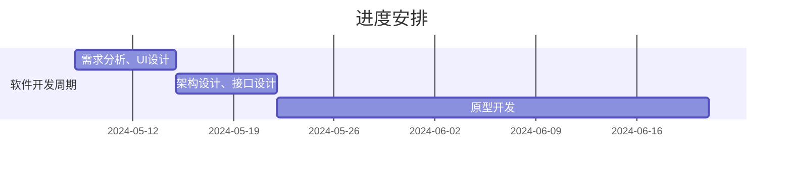
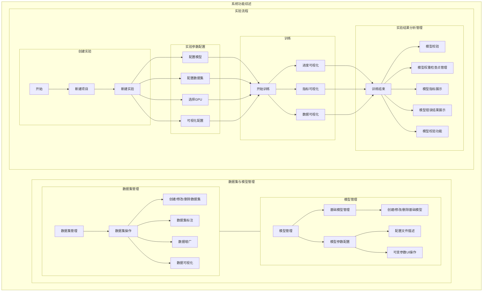
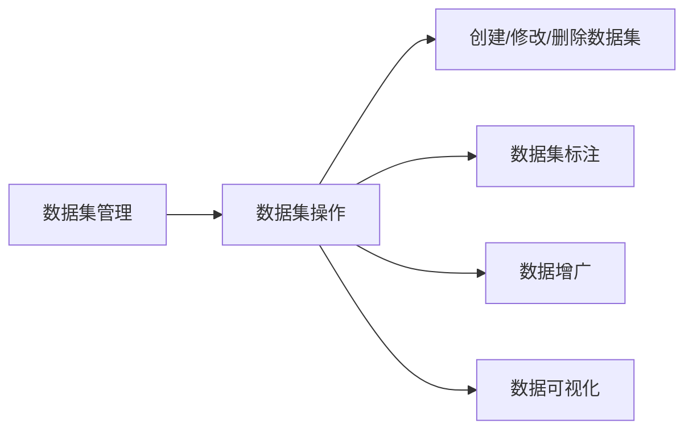
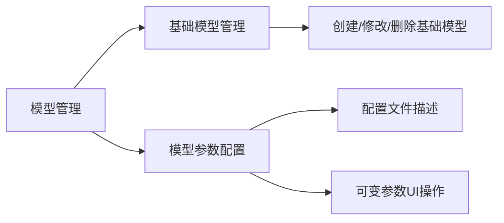
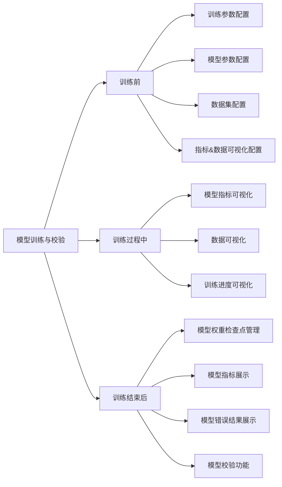
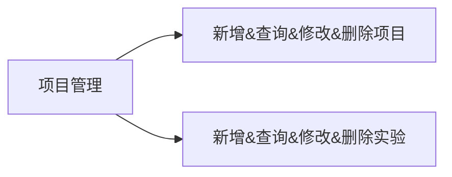
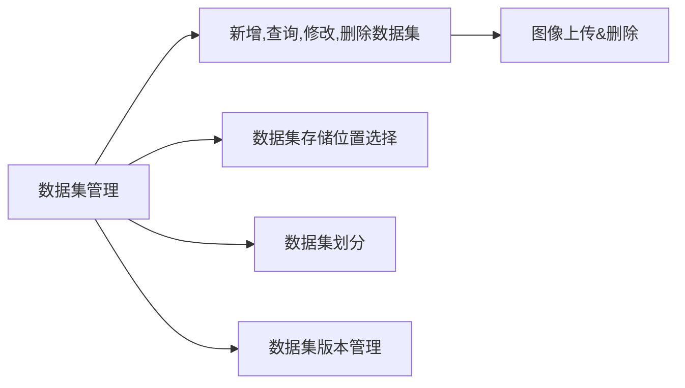
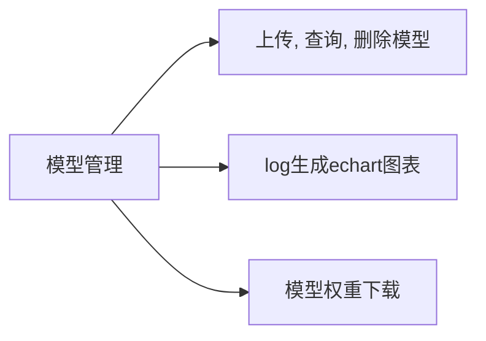
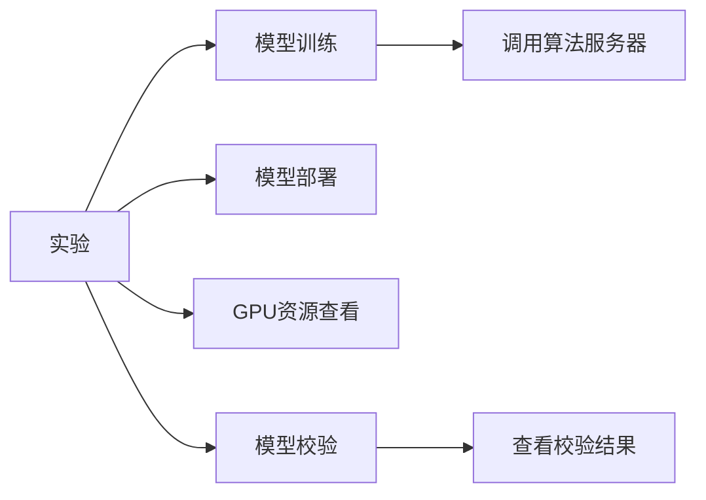

# AI算法训练平台需求文档

## 1. 引言

本需求规格说明书旨在明确AI算法训练平台软件的开发目标、功能需求、性能需求、非功能需求、接口需求、约束条件、测试要求等，为软件开发团队提供清晰、准确的设计和实现依据。本文档以用户具体实际业务为指南，汇总、分析、理顺、优化管理机制和业务关系等方面需求，求同存异，结合IT技术再其他棱线行业的成功应用积累，从业务需求、功能需求、非功能要求、运行维护等多方面进行详细的描述，为下步研发设计、测试用例、项目验收奠定坚实的基础。

## 2. 项目背景和目标

### 2.1项目背景

随着人工智能技术的快速发展，AI算法训练平台在科研、工业界等领域的应用越来越广泛。本项目旨在开发一款高效、易用、可扩展的AI算法训练平台软件，以满足用户在算法开发、模型训练、性能优化等方面的需求。

### 2.2 项目目标

项目的核心目标是开发一款功能强大、操作简便的深度学习平台，旨在为用户提供高效、稳定的模型训练和部署服务。通过该平台，用户即可轻松完成模型训练、评估和部署等工作，从而加速机器学习技术在各个领域的应用和落地。

### 2.3 运行环境

操作系统：Ubuntu 22.04

前端部署环境：APACHE TOMCAT 9.0.0.33、Tengine2.4.0

后端部署环境：Java JDK17

数据库及版本：MySQL 8.0.21

### 2.4 进度安排

1、5月中旬完成需求分析与UI设计，５月底完成架构设计与接口设计；

2、6月底之前完成原型开发；



## 3. 业务需求



### 3.1 工作空间管理需求

工作空间共包括两级权限管理，项目层级用于区分不同项目，实验层级用于区分同一项目的不同实验，其中：

1. “项目”指对于某一具备特定任务处理功能的网络训练需求，同一项目中仅存在一类任务。

2. “实验”位于项目管理层级之下，通过该层级实现针对同一任务，使用不同数据集、模型进行训练、校验的过程，达到网络模型筛选的目的。

### 3.2 数据集管理需求



该系统应当支持针对数据集的创建、修改等操作，以满足模型训练、校验的需求。其中包括：

1. **数据集管理**：支持数据集的创建、修改、删除、上传、下载等操作，并支持数据集版本管理。
2. **数据标注**：提供数据标注工具，支持多种模态的数据标注功能。
3. **数据增广**：通过数据增强算法提供数据增广功能。
4. **数据可视化**：可在数据集详情界面查看数据信息。

### 3.3 模型管理需求



该系统应当支持相应的模型管理功能以满足使用需求。其中包括：

1. **基础模型管理**：支持基础模型的创建、修改、删除。其中基础模型为平台共用。
2. **模型管理**：基于基础模型的模型创建、修改等操作。其中模型为平台共用，在模型创建过程中应当使用配置文件对模型进行描述，并约定可变参数与固定参数，可变参数应当允许通过软件UI中相应操作进行更改。

### 3.4 模型训练与校验需求



该系统应当支持相应的训练管理功能以满足使用需求。其中包括：

##### **训练前：**

1. **训练参数配置**：能够在训练任务开始前设置训练参数，其中包括**批量大小**、**迭代次数**、**是否加载预训练模型**、**加载哪个预训练模型**等。
2. **模型参数配置**：能够在训练任务开始前选择或创建模型，并支持修改模型参数，模型参数相关功能见3.5.2中描述。
3. **模型指标可视化配置**：能够在训练任务开始之前对需要进行可视化的模型指标进行选择。
4. **参数可视化配置**：能够在训练任务开始之前对指定的需要进行可视化的参数进行选择。
5. **数据集配置**：能够在训练任务开始之前进行数据集选择，并关联数据集修改功能。

##### **训练中：**

1. **模型指标可视化**：训练过程中应当能够对指定的模型指标使用可交互图表进行可视化。
2. **数据可视化**：训练过程中应当能够对预先设置的数据及其他数据使用可交互图表或图像等形式进行可视化。
3. **训练进度可视化**：训练过程中应当能够通过UI展示训练进度。

##### **训练结束后：**

1. **模型权重检查点管理**：能够在训练结束后对产生的权重检查点进行删除、导出等操作。

2. **模型校验功能**，能够在训练结束后对指定的模型权重进行性能校验，其中包括：

   - **模型校验配置**：提供界面允许用户配置校验过程中的参数，如批量大小、迭代次数等。

   - **性能指标选择**：用户可以选择用于评估模型性能的指标，如准确率、召回率、F1分数、均方误差等。
   - **实时性能反馈**：在模型校验过程中，实时显示性能指标的变化。

   - **校验报告生成**：自动化生成包含性能指标和可视化结果的校验报告。
   - **模型比较**：允许用户比较不同模型或不同版本或不同参数设置下的性能。
   - **结果分析工具**：提供错误分析工具，帮助用户理解模型在哪些类型的数据上表现不佳。
   - **模型解释性工具**：提供模型解释性工具，帮助用户理解模型的决策过程。

   - **校验结果导出**：允许用户将校验结果和报告导出为PDF、CSV或JSON格式。

## 4. 功能需求

### 4.1项目管理



该系统应当支持相应的项目管理功能以满足使用需求。其中包括：

1. **新增、查询、修改、删除项目**：支持项目的创建、查询、修改、删除。
2. **新增、查询、修改、删除实验**：支持实验的创建、查询、修改、删除。

### 4.2数据集管理



该系统应当支持相应的数据集管理功能以满足使用需求。其中包括：

1. **新增、查询、修改、删除数据集**：支持数据集的创建、查询、修改、删除。在修改数据集时可新增/删除图像。
2. **数据集存储位置选择**：支持选择数据集的存储位置（如本地、MinIO）。
3. **数据集划分**：支持数据集的划分，包括训练集、验证集和测试集。
4. **数据集存版本管理**：支持数据集版本管理。

### 4.3模型管理



该系统应当支持相应的模型集管理功能以满足使用需求。其中包括：

1. **上传、查询、删除模型**：支持模型上传、查询、删除。
2. **log生成echart图表**：支持将算法模型生成的log日志展示成Echart图表。
3. **模型权重下载**：支持对模型训练过程中的权重进行下载。

### 4.4实验



该系统应当支持相应的实验功能以满足使用需求。其中包括：

1. **模型训练**：支持在UI界面配置训练参数，并对参数封装发送至算法服务器进行模型训练。
2. **模型部署**：支持将算法模型生成的log日志展示成Echart图表。
3. **GPU资源查看**：支持实验时查看GPU资源状态。
4. **模型校验**：支持对已训练的模型进行模型校验。

## 5. 非功能需求

### 5.1易用性需求

软件界面应简洁明了，操作便捷，提供完善的用户手册和在线帮助文档。

### 5.2性能需求

1. AI算法训练平台接口响应时间：tps300，响应时间5s以内。

2. 数据库设计上，数据量大的报表，实现实时与非实时查询相结合，将可以延后查询的数据全部放在深夜由数据库启动相关存储过程自动分析处理。

3. 在数据查询条件编写上，将时刻注意查询条件位置，优化查询语句，并随时检查复合索引是否已创建，使用空间换性能等方式提高查询效率。

4. 在编码时必须做到能不访问数据库的地方，绝不向数据库读取数据；对于需要反复读取的数据，可以存放到IIS缓存或Redis缓存中，减少数据库访问次数；可以使用XML、JS等文本方式读取数据的，根据具体的生成频率状况，有选择性的使用。尽量使用空间换性能的方式进行处理，减轻服务器的负担，提高用户访问效率。

5. 前台页面采用模版缓存方式，减少页面与数据库的交互，提交用户访问效率。

### 5.3安全性需求

软件应保障用户数据的安全性，采取加密存储、访问控制等措施防止数据泄露和非法访问。

### 5.4可扩展性

随着业务的发展，系统在设计上考虑到未来功能的开发能够预留一定的应用扩展空间。框架完全自主开发，实现功能模块化、组件化、可继承，数据访问层统一采用MyBatis-Plus代码生成器生成，减轻开发人员开发工作量与减少出错的可能；业务逻辑层常用函数统一使用MyBatis模版生成，自定义函数编写也采用高度集合继承与封装方式，全部或部分使用泛类进行操作。UI层使用Element-Plus及ECharts框架，只需要传入相关的数据库表名和相关参数，可以减轻开发人员对于UI绘制以及分页、排序、新增、编辑与删除等各种常用功能所花费的开发时间。

### 5.5可靠性

从操作系统的安全性、访问控制、数据的完整性以及业务层的安全机制均要保证整个系统的安全、可靠地运行。

### 5.6可维护性

软件应具备良好的可维护性，方便开发人员对系统进行维护和升级。根据实际情况对系统软件进行灵活地配置和组合，能方便地进行功能的调整以及系统的升级、扩展，以适应业务的不断发展和更新。同时，系统的升级要充分考虑与现有其它应用系统的数据接口问题，尽可能保证系统有更长的生命周期。

### 5.7兼容性

需兼容市场上Edge、360、Chrome浏览器等主流的浏览器类型。

### 5.8稳定性需求

软件应具有高稳定性，能够长时间稳定运行，避免因意外情况导致的数据丢失或系统崩溃。

## 6. 接口需求

### 6.1硬件接口

无硬件对接。

### 6.2软件接口

1. 数据接口：软件应提供标准的数据接口，支持与其他数据处理和分析工具的集成。
2. 算法接口：软件应提供统一的算法接口，方便用户调用和集成自定义算法。
3. 模型调用接口：软件应提供模型导出和部署的接口，支持多种平台和框架的模型部署。

#### 6.2.1项目查询

接口名称：项目查询

接口地址：/dataset/project/get

#### 6.2.2项目列表

接口名称：项目列表

接口地址：/dataset/project/list

#### 6.2.3项目新增

接口名称：项目新增

接口地址：/dataset/project/add

#### 6.2.4项目编辑修改

接口名称：项目编辑修改

接口地址：/dataset/project/update

#### 6.2.5项目删除

接口名称：项目删除

接口地址：/dataset/project/delete

#### 6.2.6数据集列表

接口名称：数据集列表

接口地址：/dataset/list

#### 6.2.7数据集查询

接口名称：数据集查询

接口地址：/dataset/get

#### 6.2.8数据集新增

接口名称：数据集新增

接口地址：/dataset/add

#### 6.2.9数据集编辑修改

接口名称：数据集编辑修改

接口地址：/dataset/update

#### 6.2.10数据集删除

接口名称：数据集删除

接口地址：/dataset/delete

#### 6.2.11模型查询

接口名称：模型查询

接口地址：/model/get

#### 6.2.12模型列表

接口名称：模型列表

接口地址：/model/list

#### 6.2.13模型新增

接口名称：模型新增

接口地址：/model/add

#### 6.2.14模型编辑修改

接口名称：模型编辑修改

接口地址：/model/update

#### 6.2.15模型删除

接口名称：模型删除

接口地址：/model/delete

#### 6.2.16算法模型训练

接口名称：算法模型训练

接口地址：/model/train

#### 6.2.17算法模型预测

接口名称：算法模型预测

接口地址：/model/predict

## 7. 约束条件

1. 技术约束：软件开发应遵循现有的技术标准和规范，确保系统的兼容性和可移植性。
2. 资源约束：软件开发应充分考虑硬件资源的限制，合理利用资源，避免资源浪费。
3. 时间约束：软件开发应按时完成，确保项目按时交付。

## 8. 测试要求

1. 功能测试：对软件的功能进行全面测试，确保各项功能符合需求规格说明书的要求。
2. 性能测试：对软件的性能进行测试，包括响应时间、稳定性、可扩展性等方面的测试。
3. 安全测试：对软件的安全性进行测试，确保用户数据的安全性和系统的稳定性。

## 9. 附录

本需求规格说明书是对AI算法训练平台软件需求的详细描述，为软件开发团队提供了明确的设计和实现依据。在软件开发过程中，应根据本说明书的要求进行设计和实现，确保软件的质量和性能符合用户的期望。

### 9.1术语定义

- **任务** ： 机器学习模型需要解决的具体问题或目标。深度学习任务可以非常多样，取决于应用场景和所需达成的目标。
- **模型**： 机器学习或深度学习使用的数学过程，其包括一组可学习的**模型权重**，通过训练数据集可对其参数进行学习，本文档中指代具体的模型个体而非概念本身。
- **模型参数**：在本文档中模型参数指代**模型本身的参数**，即定义模型结构和行为的一系列参数（如**某网络层数**、**某层卷积网络卷积核尺寸**、**某层网络的激活函数**等），这些参数在模型创建时被指定，并决定了模型的复杂性、容量以及它如何从数据中学习。
- **训练参数**：训练参数即为定义训练过程的一系列参数，例如**学习率**、**优化器**等。
- **基础模型**：基础模型指在某个领域或任务中被广泛研究和应用的模型，它们通常具有代表性和基准性，为其他研究提供了比较的标准，基础模型可以作为进一步优化和调整的基础，通过添加新的层、改变网络结构或调整参数来适应特定的应用需求，本文档中指代具体的基础模型个体而非概念本身。
- **模型权重**： 见“模型”。
- **数据集**： 在机器学习中，数据集（Dataset）是一组数据的集合，这些数据被用来“训练”（train）或“测试”（test）一个机器学习模型。通常数据集会被划分为训练集（Training Set）、验证集（Validation Set）和测试集（Test Set）。
- **标签**： 标签是与数据样本相关联的输出值。在分类任务中，标签通常是类别名称；在回归任务中，标签是一个连续值。
- **标注**： 动词，指通过模型自动产生标签或通过标注软件人工标注标签的过程。
- **标签类型**： 针对不同的任务，标签会有不同的形式，称为标签类型。
- **训练**： 在机器学习中，训练（Training）是一个核心过程，指的是使用训练数据集来调整模型参数，使得模型能够对未知数据做出准确预测或分类的过程。
- **性能指标**：指用来评估模型在完成特定任务时效果的一系列度量标准。选择合适的性能指标对于理解模型的强弱点、指导模型的选择和改进至关重要。
- **校验**： 使用特定的模型加载训练好的模型权重，并处理特定的数据集，通过观测输出结果对模型训练权重的性能做出定性或定量评估的过程，其中定量评估的标准为**性能指标**。
- **数据增广**：通过一系列算法对数据集进行处理（旋转、平移、缩放、mixup等），实现数据集扩充。
- **训练时增强**：训练时通过数据增广算法在数据输入模型前进行处理，提升训练性能。
- **测试时增强**：测试时通过数据增广算法在数据输入模型前进行处理，提升模型性能。

### 9.2数据集格式规范

#### 9.2.1 OpenMMLab 2.0数据集格式规范

OpenMMLab 2.0 数据集格式规范规定注释文件必须采用`json`或者 `yaml`、`yml`或者 `pickle`、`pkl`的格式。注释文件中存储的字典必须包含两个字段，`metainfo`和`data_list`。

`metainfo`是一个包含有关数据集的元信息的字典。

`data_list`是一个列表，其中每个元素都是一个字典，字典定义了原始数据信息。每个原始数据信息包含一个或多个训练/测试样本。

#### 9.2.2分类任务

以下是数据和注释文件存放格式：

```
data
├── annotations
│   ├── train.json
│   ├── val.json
│   ├── test.json
└─  images
    ├── train
    │   ├── classA
    │   │   ├── classA_0.jpg
    │   │   ├── classA_1.jpg
    │   ├── classB
    │   │   ├── classB_0.jpg
    │   └─  ...
    ├── val
    ├── test
```

以下是标注文件的示例：

```json
# 图像分类任务的注释文件 train.json
{
    "metainfo":
        {
            "image_classes": ["classA", "classB",...],
            "dataset_type": "train",
            "task_type": "classification",
            "classes_indices": {"classA":0, "classB":1},
            "license":{"name": str, "url": str}
        },
    "data_list":
        [
            {
                "file_id": 123456789, # 图片id,智能标注时使用
                "img_path": "classA/classA_0.jpg",
                "img_label": 0 #或多标签0,1
            },
            {
                "file_id": 123456790, # 图片id,智能标注时使用
                "img_path": "classA/classA_1.jpg",
                "img_label": 0 #或多标签0,1
            },
            {
                "file_id": 123456791, # 图片id,智能标注时使用
                "img_path": "classB/classB_0.jpg",
                "img_label": 1 #或多标签0,1
            }
        ]
}
```

#### 9.2.3目标检测任务

以下是数据和注释文件存放格式：

```
data
├── annotations
│   ├── train.json
│   ├── val.json
│   ├── test.json
└─  images
    ├── train
    │   ├── classA
    │   │   ├── classA_0.jpg
    │   │   ├── classA_1.jpg
    │   ├── classB
    │   │   ├── classB_0.jpg
    │   └─  ...
    ├── val
    ├── test
```

以下是注释文件的示例：

# 目标检测任务的注释文件 train.json

两点坐标式

1、直线型

```json
#  目标检测任务的注释文件 train.json
{
    "metainfo":
    {
        "object_classes": ["classA", "classB",...],
        "dataset_type": "train",
        "task_type": "detection",
        "classes_indices": {"classA":0, "classB":1},
        "label_type":"line"

    },
    "data_list":
    [
      {
        "file_id": 123456789,  # 图片id,智能标注时使用
        "img_path": "/train/img0.jpg",
        "height": 604,
        "width": 640,
        "channel": 3,
        "objects": 2,
        "instances":
        [
          {
            "line": {"xmin": 0,"ymin": 0,"xmax": 3,"ymax": 5}(直线的两点坐标),
            "line_label": 1,
            "length":20
          },
          {
            "line": {"xmin": 5,"ymin": 5,"xmax": 7,"ymax": 9},
            "line_label": 0,
            "length":30
          }
        ]
      },
    ]
}
```

2、矩形目标检测

```json
{
    "metainfo":
    {
        "object_classes": ["classA", "classB",...],
        "dataset_type": "train",
        "task_type": "detection",
        "classes_indices": {"classA":0, "classB":1},
        "label_type":"rectangle"
    },
    "data_list":
    [
      {
        "file_id": 123456789,  # 图片id,智能标注时使用
        "img_path": "/train/img0.jpg",
        "height": 604,
        "width": 640,
        "channel": 3,
        "objects": 2,
        "instances":
        [
          {
            "bbox": {"xmin": 0,"ymin": 0,"xmax": 3,"ymax": 5},
            "bbox_label": 1,
            "truncated": 0 or 1(是否截断),
            "area":20
          },
          {
            "bbox":{"xmin": 5,"ymin": 5,"xmax": 7,"ymax": 9},
            "bbox_label": 0,
            "truncated": 0 ,
            "area":30
          }
        ]
      },
    ]
}
```

3、圆形(暂定中心点+半径)

```json
{
    "metainfo":
    {
        "object_classes": ["classA", "classB",...],
        "dataset_type": "train",
        "task_type": "detection",
        "classes_indices": {"classA":0, "classB":1},
        "label_type":"circle"

    },
    "data_list":
    [
      {
        "file_id": 123456789,  # 图片id,智能标注时使用
        "img_path": "/train/img0.jpg",
        "height": 604,
        "width": 640,
        "channel": 3,
        "objects": 2,
        "instances":[
		  {
			"area":268609.31,
			"coor":{
               "x":1869,
               "y":626
		     },
		    "truncated":0,
		    "remark":"",
		    "radius":292.4055403031892,
		    "circle_label":0
	     },
	     {
		    "area":1700547.24,
		    "coor":{
			  "x":836,
			  "y":456
		    },
		   "truncated":0,
		   "remark":"",
		   "radius":735.7316086726191,
		   "circle_label":1
	     }
       }
    ]
}
```


#### 9.2.4语义分割任务

以下是数据和注释文件存放格式：

```
data
├── annotations
│   ├── train.json
│   ├── val.json
│   ├── test.json
└─  images
    ├── train
    │   ├── classA
    │   │   ├── classA_0.jpg
    │   │   ├── classA_1.jpg
    │   ├── classB
    │   │   ├── classB_0.jpg
    │   └─  ...
    ├── val
    ├── test
```

以下是注释文件的示例：

```json
#  语义分割任务的注释文件

{
    "metainfo":
    {   "object_classes": ["cat", "dog"],
        "dataset_type": "train",
        "task_type": "segmentation",
        "classes_indices":{"cat":0, "dog":1},
        "license":{"name": str, "url": str}
    },
    "data_list": [
        {
            "file_id": "1234567890", # 图片id,智能标注时使用
            "img_path": "segmentation_img.jpg",
            "mask_path": "segmentation_mask.jpg",
            "height": 800,
            "width": 600,
            "channel": 3,
            "iscrowd": 0 or 1(是否为单个对象),
            "instances": [
                {
                    "segmentation_label": 1,
                    "segmentation_pixel_value": 1(标签值即为像素值),
                    "area":50,
                    "truncated": 0
                },
                {
                    "segmentation_label": 0,
                    "segmentation_pixel_value": 0,
                    "area":20,
                    "truncated": 0
                }
            ]
        }
    ]
}
```

#### 9.2.5实例分割任务

以下是数据和注释文件存放格式：

```
data
├── annotations
│   ├── train.json
│   ├── val.json
│   ├── test.json
└─  images
    ├── train
    │   ├── classA
    │   │   ├── classA_0.jpg
    │   │   ├── classA_1.jpg
    │   ├── classB
    │   │   ├── classB_0.jpg
    │   └─  ...
    ├── val
    ├── test
```

以下是注释文件的示例：

```json
#  实例分割任务的注释文件
{
    "metainfo":
    {   "object_classes": ["cat", "dog"],
        "dataset_type": "train",
        "task_type": "segmentation",
        "classes_indices": {"cat":0, "dog":1},
        "license":{"name": str, "url": str}
    },
    "data_list": [
        {
            "file_id": "1234567890", # 图片id,智能标注时使用
            "img_path": "segmentation_img.jpg",
            "mask_path": "segmentation_mask.jpg",
            "height": 800,
            "width": 600,
            "channel": 3,
            "iscrowd": 0 or 1(是否为单个对象),
            "instances": [
                {
                    "segmentation_label": 1,
                    "segmentation_pixel_value": 1(同一类别的不同对象使用不同的像素值),
                    "area":50,
                    "truncated": 0
                },
                {
                    "segmentation_label": 1,
                    "segmentation_pixel_value": 2,
                    "area":50,
                    "truncated": 0
                },
                {
                    "segmentation_label": 1,
                    "segmentation_pixel_value": 3,
                    "area":50,
                    "truncated": 0
                },
                {
                    "segmentation_label": 0,
                    "segmentation_pixel_value": 4,
                    "area":50,
                    "truncated": 0
                }
            ]
        }
    ]
}
```
